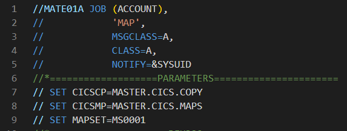

<h3 align="center">CICS / TP1</h3>


---

<p align="center"> Creation BMS map
    <br> 
</p>

## 📝 Table of Contents

- [About](#about)

## 01 - Preparation <a name = "about"></a>

First of all, we need to setup PDS for CICS.  
- <YOUR_PATH>.CICS.MAPS
- <YOUR_PATH>.CICS.LOAD

## 02 - BMS <a name=""></a>

Get the [BMS map](map_bms) and place it on : ```<YOUR_PATH>.CICS.MAPS```


## 03 - JCL <a name=""></a>

Get the [JCL COMPILATION](comp_jcl.jcl) and place it wherever you want.

## 04 - Configure the JCL <a name=""></a>

  <br>
In the JCL file, I placed some variables that you should modify to be sure that your path is right.  
Only the PARAMETERS must be modified, DFH320 section is about compilation specifications.

## 05 - CICS <a name=""></a>

After that, execute the program. It could provides you 2 things :
- A **Symbolic** MAP : in ```<YOUR_PATH>.CICS.COPY```
- A **Physical** MAP : in ```DFH320.CICS.SDFHLOAD```

The **Symbolic** map is used in a COBOL programm  
The **Physical** map is used in CICS


### Launch CICS

1. Launch another 3270 terminal and launch the command ```L CICS32```.  
2. ```CESN``` then connect you with IBMUSER account
3. See your map with : ```CECI SEND MAP(<THE_NAME_OF_YOUR_MAPSET>)```