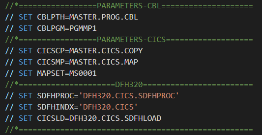

<h3 align="center">CICS / TP2</h3>


---

<p align="center"> COBOL / CICS program
    <br> 
</p>

<h3> 📝 Table of Contents</h3>

- [01 - Preparation ](#01---preparation-)
- [02 - BMS ](#02---bms-)
- [03 - COBOL ](#03---cobol-)
- [04 - JCL ](#04---jcl-)
- [05 - Configure the JCL ](#05---configure-the-jcl-)
- [06 - CICS ](#06---cics-)
  - [Launch CICS](#launch-cics)

## 01 - Preparation <a name = "01"></a>

First of all, we need to setup PDS for CICS.  
- <YOUR_PATH>.CICS.MAPS
- <YOUR_PATH>.CICS.LOAD

## 02 - BMS <a name="02"></a>

Get the [BMS map](map_bms) and place it on : ```<YOUR_PATH>.CICS.MAPS```

## 03 - COBOL <a name="03"></a>

Get the [cobol program](cobol.cbl) and place it on : ```<YOUR_PATH>.PROG.CBL```


## 04 - JCL <a name="04"></a>

Get the [JCL COMPILATION](compilation.jcl) and place it wherever you want.

## 05 - Configure the JCL <a name="05"></a>

  <br>
In the JCL file, I placed some variables that you should modify to be sure that your path is right.  
Only the PARAMETERS must be modified, DFH320 section is about compilation specifications.

## 06 - CICS <a name="06"></a>

After that, execute the program. It could provides you 2 things :
- A **Symbolic** MAP : in ```<YOUR_PATH>.CICS.COPY```
- A **Physical** MAP : in ```DFH320.CICS.SDFHLOAD```

The **Symbolic** map is used in a COBOL programm  
The **Physical** map is used in CICS

### Launch CICS

1. Launch another 3270 terminal and launch the command ```L CICS32```.  
2. ```CESN``` then connect you with IBMUSER account
3. ```CEDA DEF MAPSET(<THE_NAME_OF_YOUR_MAPSET>) GROUP(<A_GROUP>)```
4. ```CEDA INS MAPSET(<THE_NAME_OF_YOUR_MAPSET>) GROUP(<A_GROUP>)```
5. ```CEDA DEF PROGR(<THE_NAME_OF_YOUR_PROGRAM>) GROUP(<A_GROUP>)```
6. ```CEDA INS PROGR(<THE_NAME_OF_YOUR_PROGRAM>) GROUP(<A_GROUP>)```
7. ```CEDA DEF TRANS(<4_CHARACTERS_NAME>) PROGR(<THE_NAME_OF_YOUR_PROGRAM>) GROUP(<A_GROUP>)```
8. ```CEDA INS TRANS(<4_CHARACTERS_NAME>) GROUP(<A_GROUP>)```
9.  Write : ```<THE_TRANSACTION_INSTALLED>``` on the CICS home screen